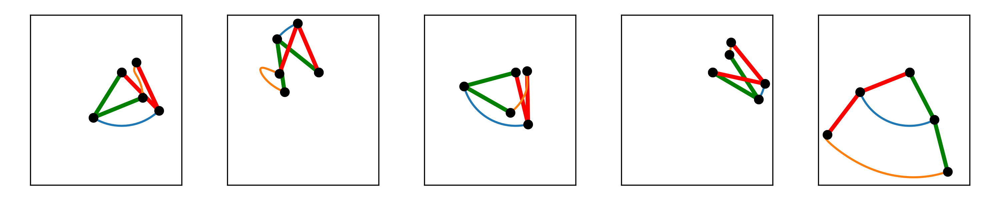
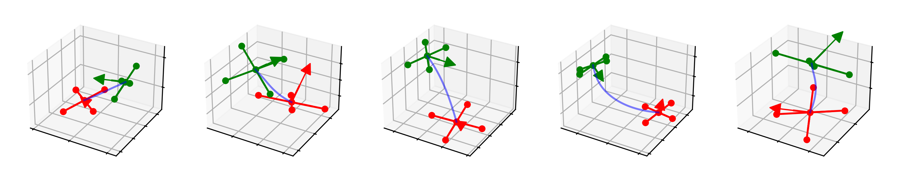

# Dynobench 🦖

Dynobench 🦖 is a universal benchmark for kinodynamic motion planning. Develop, combine and compare methods of different algorithmic families, from trajectory optimization and sample based motion planning to reinforcement and supervised learning.

<p align="center">

</p >

## Robots and Problem Description 

Kinodynamic motion planning problem are defined in [Dynobench](https://github.com/quimortiz/dynobench)

Acrobot
<p align="center">

</p >

Planar Rotor
<p align="center">

</p >

Planar Rotor Pole
<p align="center">

</p >

Quadrotor
<p align="center">

</p >

Unicycle1
<p align="center">

</p >


# Using Dynobench

### Submodule

You can use Dynobench as a submodule.


Using `cmake`, import the library with:

```cmake
add_subdirectory(dynobench EXCLUDE_FROM_ALL) # use EXCLUDE_FROM_ALL to avoid
                                             # building the tests
...cmake
target_link_libraries(
  my_target
  PRIVATE dynobench::dynobench )
```

As an example, you can check the `CMakeLists.txt`  and the project structure in [Dynoplan](https://github.com/quimortiz/dynoplan)


### As external Project

First, build Dynobench from source and install with:

```bash
git clone https://github.com/quimortiz/dynobench
cd dynobench && mkdir build && cd build
cmake .. -DCMAKE_INSTALL_PREFIX=MY_PATH && make install
```

Then, add the following lines in `CMakeLists.txt` of your repository:

```cmake
find_package(dynobench REQUIRED)
...
target_link_libraries(my_target PRIVATE dynobench::dynobench )
```

And add the path of the local installation
```bash
cmake .. -DCMAKE_PREFIX_PATH=MY_PATH
```

## Hello World with Dynobench

### C++ library


main.cpp
```cpp
#include <iostream>
#include "dynobench/robot_models.hpp"

int main() {

  Model_car_with_trailers car;

  std::cout << "Hello World!" << std::endl;
}

```

CMakeLists.txt (using Dynobench as an external project)
```cmake
cmake_minimum_required(VERSION 3.5)
project(
  use_dynobench
  VERSION 0.1.0
  LANGUAGES CXX)

set(CMAKE_CXX_STANDARD 17)
set(CMAKE_CXX_STANDARD_REQUIRED On)

find_package(Boost REQUIRED COMPONENTS program_options unit_test_framework
                                       serialization)
find_package(fcl REQUIRED)
find_package(dynobench REQUIRED)
find_package(yaml-cpp REQUIRED)

add_executable(main main.cpp)

# target_include_directories(main PRIVATE ${DYNOBENCH_INCLUDE_DIRS} )

target_link_libraries(main PRIVATE dynobench::dynobench yaml-cpp)
```


### Python Viewer

Check the viewers with:
```bash
 python3 ../utils/viewer/viewer_test.py
```
and

```bash
VISUALIZE=1 python3 ../utils/viewer/viewer_test.py
```


### Python Bindings

We provide python bindings for the dynamical systems

Check the example with,


```
python ../example/test_robot.py
```
from the `build` directory.

## Adding a new dynamical system


In this short tutorial, we summarize the steps we followed to add the model
`Integrator2_2d`.

`Integrator2_2d` is a double integrator in 2d:

The state is $\mathbf{x} = [x,y, \dot{x}, \dot{y}]$, control is $\mathbf{u} = [\ddot{x} , \ddot{y}]$.
Second order dynamics are $\frac{d}{d t}[ \dot{x}, \dot{y} ]  =  \mathbf{u}$. Thus, the step function is $\mathbf{x}_{k+1} = A \mathbf{x} + B \mathbf{u} $
with:

```math
A =
\begin{bmatrix}
1 & 0 & \Delta t  & 0 \\
0 & 1 & 0  &  \Delta t  \\
0 & 0 & 1 & 0 \\
0 & 0 & 0 & 1
\end{bmatrix} ,

B =
\begin{bmatrix}
0 & 0 \\
0 & 0 \\
\Delta t & 0 \\
0 & \Delta t
\end{bmatrix}
```

Control Bounds are $|u_x| \leq 1$,  $|u_y| \leq 1$, and state bounds on velocity $|\dot{x}| \leq 1 $,  $|\dot{y}| \leq 1 $.

First, we have implemented a new class in `src/integrator2_2d.cpp` and `include/dynobench/integrator2_2d.hpp`. We store all parameters in a separate class, `Integrator2_2d_params`.
A robot model implements 4 main functionalities: distance and cost bounds between states, a dynamics function, bounds on state and control, and collision against obstacles. Check the code!

```cpp
// dynobench/double_integrator_2d.hpp and src/double_integrator_2d.hpp

struct Integrator2_2d_params { ... } ;

struct Integrator2_2d : public Model_robot { ... };
```

The base class `Model_robot` already provides default implementation of some methods.

For example, we only have to implement the dynamics in continuous time $\dot{x} = f(x,u)$ and the derivatives, while the Euler step is computed in the base class.

Once the model is ready, we add it to the factory:

```cpp
// src/robot_models.cpp

#include "dynobnech/double_integrator_2d.hpp"

...
std::unique_ptr<Model_robot> robot_factory(
...

 else if (dynamics == "double_intergrator_2d") {
    return std::make_unique<Double_integrator_2d>(file, p_lb, p_ub);
  }


```
It is recommend to check the Jacobians using finite differences. We add the test `t_integrator2_2d` in  test in `test/test_models.cpp`.

```cpp
// test/test_models.cpp
  model->calcDiffV(Jx, Ju, x0, u0);

  finite_diff_jac(
      [&](const Eigen::VectorXd &x, Eigen::Ref<Eigen::VectorXd> y) {
        model->calcV(y, x, u0);
      },
      x0, 4, Jx_diff);

  finite_diff_jac(
      [&](const Eigen::VectorXd &u, Eigen::Ref<Eigen::VectorXd> y) {
        model->calcV(y, x0, u);
      },
      u0, 4, Ju_diff);

  BOOST_TEST((Jx - Jx_diff).norm() < 1e-5);
  BOOST_TEST((Ju - Ju_diff).norm() < 1e-5);

```

Now we add the c++ file to the library:

```cmake
add_library(
  dynobench
  ./src/robot_models.cpp
...
  ./src/integrator2_2d.cpp)
```

We define `double_integrator_2d_v0` with a configuration file `models/integrator2_2d_v0.yaml`, and one scenario with `envs/integrator2_2d_v0/park.yaml`

Let's add a viewer in python. We need a new class:

```python
//utils/viewer/integrator2_2d_viewer.py

class Robot :

class Integrator2_2dViewer (RobotViewer):
```

`RobotViewer` is a base class that provides default functionality. `Robot` is the class that draws the robot (e.g. using a rectangle )


```python
// utils/viewer/viewer_cli.py

def get_robot_viewer(robot: str) -> robot_viewer.RobotViewer:
...
    elif robot == "integrator2_2d":
        viewer = double_integrator_2d_viewer.Integrator2_2dViewer()

```


Now, you can view the robot with (e.g. from build directory):

```bash
python3 ../utils/viewer/viewer_cli.py --robot integrator2_2d --env ../envs/integrator2_2d_v0/park.yaml -i
```


That' s all!

Now we can use  [Dynoplan](https://github.com/quimortiz/dynoplan) to solve the problem!
The planners in Dynoplan that depend on OMPL require to implement a small wrapper to interace with OMPL.


## More Motion Primitives

You will find a small set of motion primitives for each system in  [dynobench](https://github.com/quimortiz/dynobench).

A large set of primitives for each system can be downloaded from Google Drive. This can be done manually with a web browser or using the command line with [gdown](https://github.com/wkentaro/gdown). For example:

```bash
gdown --fuzzy "https://drive.google.com/file/d/1r_ecGwdfvWnVWxPsvR4d8Hjcayxg5PsB/view?usp=drive_link"
```

All primitive in two ZIP files:  https://drive.google.com/drive/folders/1-Nvctva17I8aFsWvHfdQFWTIDUNWwgcM?usp=drive_link

Primitves per system:

* unicycle1_v0
https://drive.google.com/file/d/15dXqC_OdrI8KjaHRNakYgk9IXLtTeMtt/view?usp=drive_link

* quadrotor_v1 (OMPL-style) 
https://drive.google.com/file/d/1r_ecGwdfvWnVWxPsvR4d8Hjcayxg5PsB/view?usp=drive_link

* quadrotor_v0
https://drive.google.com/file/d/1j57kwE5hFgO-46LjStv_zqm6S5BFUsY8/view?usp=drive_link

* Acrobot_v0
  https://drive.google.com/file/d/1mLiTgcpXSI9UHHss4Qt7AIsRwJPbPC2H/view?usp=drive_link

* Roto_Pole_v0
https://drive.google.com/file/d/1KMb4IDgucHN8uWI9YN_W07AhX59tkph_/view?usp=drive_link

* Planar Rotor_v0
https://drive.google.com/file/d/18kI3qXweA4RgvDxtV3vfxnfc_BhX52j8/view?usp=drive_link

* Car1_v0
https://drive.google.com/file/d/1TPX3c8RvMOy9hiaKL-kUE8M61OknDrDK/view?usp=drive_link

* Unicycle 2 _v0
  https://drive.google.com/file/d/1PoK1kbiLRFq_hkv3pVWU0csNr4hap0WX/view?usp=drive_link

* Unicycle 1 v2
https://drive.google.com/file/d/1IvwN-e1jn5P0P1ILaVwSrUnIeBlFxhHI/view?usp=drive_link

* Unicycle 1 v1
https://drive.google.com/file/d/1OLuw5XICTueoZuleXOuD6vNh3PCWfHif/view?usp=drive_link


## Roadmap

Dynobench is still in an alpha stage.

Next steps are:

- [ ] Gym interface for RL. Train PPO for unicycle park.
- [ ] Use Pinocchio to define the models
- [ ] Add a second viewer (e.g. build on top of viewers provided by Pinocchio)
- [ ] Interface to Mujoco for simulating problems with contacts.
